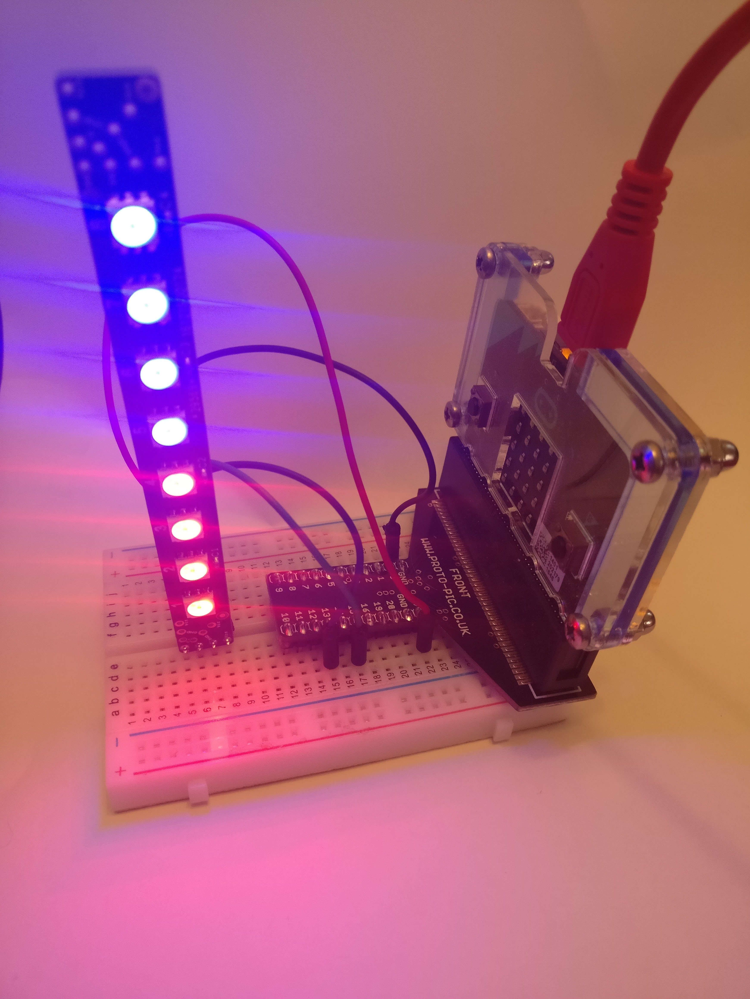

## MicroPython code for Raspi.IO Inspring

This is an experimental micropython library for Alex Eames' (@RaspiTV)
[InsPiRing](https://www.kickstarter.com/projects/raspitv/raspio-inspiring-connect-rgb-led-shapes-sculpt-you/description) strips.

### Software

I have only done limited testing so far.

The software currently uses more memory than it needs to.

This is not a problem if you are just driving a short strip of LEDs,
but it would be if you were driving larger LED arrays or doing lots of other things as well.

My next priority is to reduce memory usage and test the code with larger LED arrays.

### Hardware

My current hardware setup works but is not recommended.

I am currently living dangerously because 
1. I am using the BBC micro:bit to provide power to the LEDs.
1. I am not using a level shifter for the SPI lines.

I have connected the 0v, Vcc, CI and DI pins of the LED array to 0v, 3V and Pins 13 and 15 of the microbit
but this simple approach is not ideal for the reasons given above. 

Even with 8 LEDs in the array, the micro:bit gets dangerously hot
if several LEDs are on at once.

One of the larger LED arrays with all LEDs on full brightness would
undoubtedly exceed the power available from the micro:bit.

Once I have a larger LED array to play with I'll rewire using an external
power supply, and I may use a level shifter for the SPI lines.

